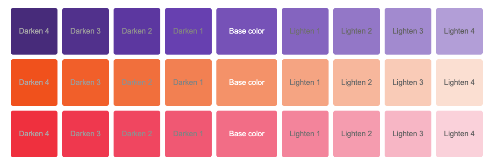
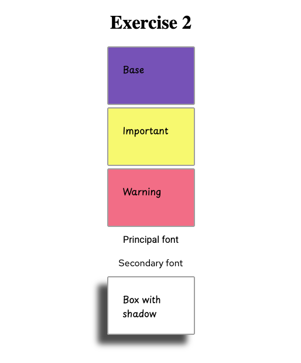
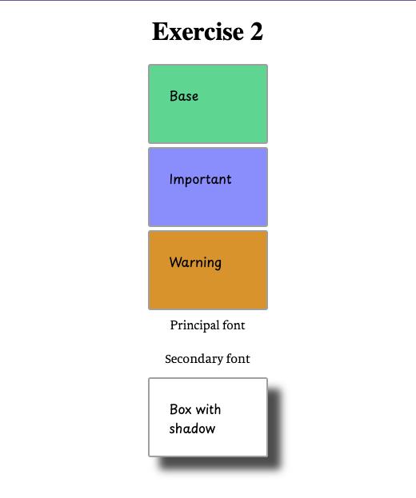
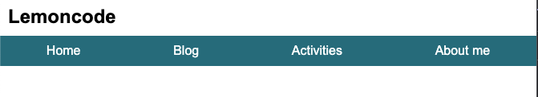
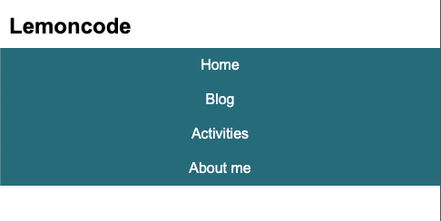
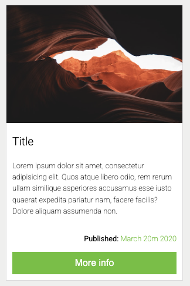

# Lemoncode Layout Module: Basic Laboratory

This repository contains a set of exercises for the **Layout Module** of the [Lemoncode Master Frontend program](https://lemoncode.net/master-frontend#master-frontend/inicio). The goal is to practice and master different layout techniques using modern CSS.

## Exercises

1. **Exercise 1: Create a dynamic color palette**

   - Use the Sass language to create different color palette themes. The idea is to start with a base color, and from that color, generate four gradually darker colors, and four gradually lighter colors.

   

2. **Exercise 2: Create two different themes.**

   - The theme changes affect the following features:
     - Background color
     - Color
     - Border Radius
     - Box shadow
     - Font family

   
   

3. **Exercise 3: Create a navigation bar using Flexbox.**

   - The HTML is completely open, meaning you can create the necessary structures as needed. The navigation bar responds to different resolutions. Use media queries to achieve this result.

   
   

4. **Exercise 4: Create a card type element with Grid CSS.**

   - Alignments should be done with this feature, but HTML is completely open.

   

---

Feel free to explore each exercise folder for detailed instructions and code samples.
